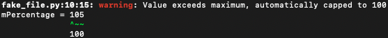

# llvm-diagnostics

Python module for creating diagnostics using the LLVM diagnostics specification

# Installation

```sh
% pip install llvm-diagnostics
```

# Usage

## Parsing a log file containing LLVM Diagnostics messages

Parsing a logging file can be done as follows:

```python
from llvm_diagnostics.parser import diagnostics_messages_from_file

for error in list(diagnostics_messages_from_file("test/resources/test.out")):
   print(f"Diagnostics Message found:")
   print(f"  File: {error.file_path}")
   print(f"  Level: {error.level}")
   print(f"  Message: {error.message}")
```

Which will result in output similar to:

```sh
Diagnostics Message found:
  File: /code/supermarket-buyer-supplier/src/offers/convert_customer_receipt.cpp
  Level: DiagnosticsLevel.WARNING
  Message: 'fruit_section' is deprecated: 2021.Q2 Deprecated Use application::supermarket_app::receipt_engine::receipt::FruitInformation::fruit_section_labels [-Wdeprecated-declarations]
```

## Reporting on Diagnostics messages

You can use `llvm-diagnostics` to create your own Diagnostics messages.

### Reporting a message in LLVM Diagnostics format

```python
import llvm_diagnostics as logger

message = logger.Warning(
   file_path='fake_file.py',
   line_number=logger.Range(start=10),
   column_number=logger.Range(start=15, range=3),
   line="mPercentage = 105",
   expectations="100",
   message='Value exceeds maximum, automatically capped to 100',
).report()
```
This will result in the following message on `stderr`:



### Reporting a message in GitHub format

```python
import llvm_diagnostics as logger

logger.config(logger.formatters.GitHub())

message = logger.Warning(
   file_path='fake_file.py',
   line_number=logger.Range(start=10),
   column_number=logger.Range(start=15, range=3),
   line="mPercentage = 105",
   expectations="100",
   message='Value exceeds maximum, automatically capped to 100',
).report()
```

This will result in the following message on `stderr`:

```sh
::warning file=fake_file.py,line=10,col=15,endColumn=18::Value exceeds maximum, automatically capped to 100
```
